<!--
  ███╗   ██╗███████╗██╗  ██╗██╗   ██╗███████╗
  ████╗  ██║██╔════╝╚██╗██╔╝██║   ██║██╔════╝     GUSTAVO NUNES // PROFILE v2.6
  ██╔██╗ ██║█████╗   ╚███╔╝ ██║   ██║███████╗     Substitua Gustavoxyx pelo seu
  ██║╚██╗██║██╔══╝   ██╔██╗ ██║   ██║╚════██║     usuário do GitHub (Ctrl+H)
  ██║ ╚████║███████╗██╔╝ ██╗╚██████╔╝███████║
  ╚═╝  ╚═══╝╚══════╝╚═╝  ╚═╝ ╚═════╝ ╚══════╝
-->

<div align="center">



<a href="https://github.com/Gustavoxyx">
  
</a>

<p>
  
  
  
</p>

</div>



## `> 01_SOBRE_MIM`

<table>
<tr>
<td width="42%" align="center">
  
</td>
<td width="58%">

```java
public class GustavoNunes extends Developer {

    String nome         = "Gustavo Nunes";
    String foco         = "Desenvolvimento & Machine Learning";
    String formacao     = "Bootcamp LAMIA — ML for Industry";
    String[] linguagens = {"Java", "C", "Python", "CSS"};
    String[] aprendendo = {"SQL", "Figma"};

    @Override
    public String missao() {
        return "Transformar dados e código em soluções reais.";
    }
}
```

- 🔭 Explorando **Machine Learning aplicado à indústria**
- 🌱 Fortalecendo a base em **Java, C e Python**
- 🎨 Dando os primeiros passos em **SQL** e **Figma**
- ⚡ Curiosidade: aprendo melhor construindo — cada projeto é um laboratório

</td>
</tr>
</table>


## `> 02_TECH_STACK`

<div align="center">


<br/><br/>


<sub><code>// carregando novos módulos...</code></sub>


</div>

## `> 03_FERRAMENTAS`

<div align="center">


</div>


## `> 04_PROJETOS`

<table>
<tr>
<td width="50%" valign="top">

### ♻️ Rede Inteligente de Negócios
<sub><code>agronegócio · sustentabilidade</code></sub>

Plataforma digital para gestão e valorização de dejetos suínos, conectando produtores, empresas e transportadores.


<a href="https://github.com/Gustavoxyx/NOME_DO_REPO"><code>[ abrir repositório ]</code></a>

</td>
<td width="50%" valign="top">

### 🧠 ML for Industry
<sub><code>bootcamp LAMIA</code></sub>

Laboratórios e desafios de Machine Learning aplicados a problemas reais da indústria.


<a href="https://github.com/Gustavoxyx/NOME_DO_REPO"><code>[ abrir repositório ]</code></a>

</td>
</tr>
<tr>
<td width="50%" valign="top">

### ⚙️ Estruturas de Dados em C
<sub><code>baixo nível · algoritmos</code></sub>

Implementações de listas, pilhas, filas e árvores, com foco em ponteiros e gerenciamento de memória.


<a href="https://github.com/Gustavoxyx/NOME_DO_REPO"><code>[ abrir repositório ]</code></a>

</td>
<td width="50%" valign="top">

### ☕ Projetos em Java
<sub><code>POO · sistemas</code></sub>

Aplicações e exercícios de orientação a objetos: classes, herança, interfaces e coleções.


<a href="https://github.com/Gustavoxyx/NOME_DO_REPO"><code>[ abrir repositório ]</code></a>

</td>
</tr>
</table>


## `> 05_OBJETIVOS_ATUAIS`

<div align="center">
  
</div>


## `> 06_TELEMETRIA`

<div align="center">


</div>

## `> 07_CONQUISTAS`

<div align="center">


</div>

## `> 08_SNAKE.EXE`

<div align="center">
<picture>
  <source media="(prefers-color-scheme: dark)" srcset="https://raw.githubusercontent.com/Gustavoxyx/Gustavoxyx/output/github-snake-dark.svg"/>
  <source media="(prefers-color-scheme: light)" srcset="https://raw.githubusercontent.com/Gustavoxyx/Gustavoxyx/output/github-snake.svg"/>
  
</picture>
</div>


## `> 09_CONEXÕES`

<div align="center">

<a href="https://www.linkedin.com/in/SEU_LINKEDIN"></a>
<a href="mailto:SEU_EMAIL@gmail.com"></a>
<a href="https://instagram.com/SEU_INSTAGRAM"></a>
<a href="https://discord.com/users/SEU_ID_DISCORD"></a>
<a href="https://github.com/Gustavoxyx"></a>

</div>

<br/>

<div align="center">


<sub><code>// conexão encerrada · obrigado pela visita · volte sempre</code></sub>

</div>
